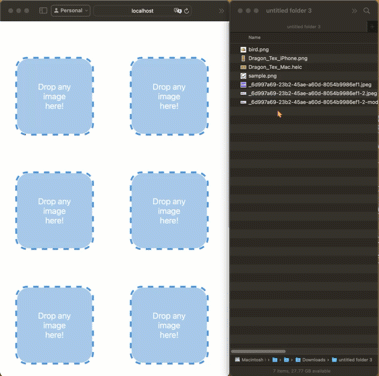

# Expo Drag Drop Content View


## What

A superset of `View` component that supports iOS, Android, and Web Native drag and drop feature.

|                      iOS                       |                        iPadOS                        |                        Android                         |
| :--------------------------------------------: | :--------------------------------------------------: | :----------------------------------------------------: |
|  |  |  |

|                                                                          Web                                                                                   |
| :------------------------------------------------------------------------------------------------------------------------------------------------------------: |
|                                                                                                                  |

## Features

- Ability to drag and drop images from other apps
- Support multi-selection

## Installation

#### 🔔 You should have expo installed in your project.

#### ✅ For Bare RN projects, you need to have [Expo Module](https://docs.expo.dev/bare/installing-expo-modules/) installed.

#### ⚠️ Expo Go is not supported, use development build instead.

You can install the package using the following command:

```sh
npx expo install expo-drag-drop-content-view
```

## Examples

- [Basic Example](./example/App.tsx)

#### 🤖 Android Specific Cautions

- Requires SDK >= 24 for Compatibility. It acts as a normal view on SDK < 24
- Android applies a highlight over the view when an image is being dragged, You can customize it using `highlightColor` and `highlightBorderRadius`
- Remember to add `android.permission.READ_MEDIA_IMAGES` permission since you are accessing an image from disk
- It only works in multi-window [Reference](https://developer.android.com/develop/ui/views/touch-and-input/drag-drop)
- `onDropStartEvent` and `onDropEndEvent` events are yet to implement

#### 🌐 Web Specific Cautions

- If you're using `Image` component from `react-native`, you need to set `draggable=true`. `Expo Image` handles this automatically

## Usage

```tsx
import {
  DragDropContentView,
  DragDropContentViewProps,
  OnDropEvent,
} from "expo-drag-drop-content-view";
import React, { useEffect, useState } from "react";
import {
  Image,
  Platform,
  Pressable,
  StyleSheet,
  Text,
  View,
} from "react-native";

const borderRadius = 20;

export const IDragDropContentView: React.FC<DragDropContentViewProps> = (
  props
) => {
  usePermission();
  const [imageData, setImageData] = useState<OnDropEvent[] | null>(null);

  const handleClear = () => setImageData(null);

  return (
    <DragDropContentView
      draggableImageSources={imageData?.map(
        (image) => (image.uri || image.base64) as string
      )}
      highlightColor="#2f95dc"
      highlightBorderRadius={borderRadius}
      onDropEvent={(event) => {
        const newData = [...(imageData ?? []), ...event.assets];
        setImageData(newData);
      }}
      style={styles.container}
    >
      {imageData ? (
        imageData.map((image, index) => {
          const uri = image.uri ? image.uri : image.base64;
          const rotation = Math.ceil(index / 2) * 5;
          const direction = index % 2 === 0 ? 1 : -1;
          const rotate = `${rotation * direction}deg`;

          return (
            <Pressable
              key={index}
              onPress={handleClear}
              style={[styles.imageContainer, { transform: [{ rotate }] }]}
            >
              <Image draggable source={{ uri }} style={styles.image} />
            </Pressable>
          );
        })
      ) : (
        <View style={styles.placeholderContainer}>
          <Text style={styles.placeholderText}>Drop any image here!</Text>
        </View>
      )}
    </DragDropContentView>
  );
};

const usePermission = () => {
  useEffect(() => {
    const fn = async () => {
      try {
        // @ts-ignore
        const PermissionsAndroid = await import("react-native").then(
          (module) => module.PermissionsAndroid
        );
        await PermissionsAndroid.request(
          "android.permission.READ_MEDIA_IMAGES"
        );
      } catch (_) {}
    };
    if (Platform.OS === "android") fn();
  }, []);
};

const styles = StyleSheet.create({
  container: {
    width: "100%",
    height: "100%",
    backgroundColor: "#fefefe",
    borderRadius,
    overflow: "visible",
    justifyContent: "center",
    alignItems: "center",
    borderWidth: 3,
    borderStyle: "dashed",
    borderColor: "#2f95dc",
  },
  imageContainer: {
    position: "absolute",
    width: "100%",
    height: "100%",
    borderRadius,
    overflow: "hidden",
  },
  image: {
    width: "100%",
    height: "100%",
    overflow: "hidden",
  },
  placeholderContainer: {
    paddingHorizontal: 30,
    backgroundColor: "#2f95dc",
    opacity: 0.5,
    height: "100%",
    width: "100%",
    justifyContent: "center",
    alignItems: "center",
    borderRadius,
  },
  activePlaceholderContainer: {
    backgroundColor: "#2f95dc",
    opacity: 1,
  },
  placeholderText: {
    color: "white",
    textAlign: "center",
  },
});
```

## Options

`DragDropContentView` supports all `View` Props. Other Props:

| Option                | iOS | Android | Web | Description                                                                                                                                                                                                                      |
| --------------------- | --- | ------- | --- | -------------------------------------------------------------------------------------------------------------------------------------------------------------------------------------------------------------------------------- |
| onDropEvent           | ✔️  | ✔️      | ✔️  | A callback that returns an array of assets. [Refer to Asset Object](#Asset-Object)                                                                                                                                               |
| onDropStartEvent      | ✔️  | ❌      | ✔️  | A callback that is called when any image is being dragged over                                                                                                                                                                   |
| onDropEndEvent        | ✔️  | ❌      | ✔️  | A callback that is called when any image is dragged out of the view's boundary or released                                                                                                                                       |
| includeBase64         | ✔️  | ✔️      | ❌  | If `true`, creates a base64 string of the image (Avoid using on large image files due to performance). It is always `true` on `Web` since it is the only available source                                                                                                                            |
| draggableImageSources           | ✔️  | ✔️      | ✔️  | Sources of the images that can be dragged around the screen. Pass Image Uri on iOS and Android, and base64 on Web.
| highlightColor        | ❌  | ✔️      | ❌  | The background color of overlay that covers the view while content is being dragged [Android Doc](<https://developer.android.com/reference/kotlin/androidx/draganddrop/DropHelper.Options.Builder#setHighlightColor(int)>)       |
| highlightBorderRadius | ❌  | ✔️      | ❌  | The border-radius of overlay that covers the view while content is being dragged [Android Doc](<https://developer.android.com/reference/kotlin/androidx/draganddrop/DropHelper.Options.Builder#setHighlightCornerRadiusPx(int)>) |

## Asset Object

| key      | iOS | Android | Web | Description                                 |
| -------- | --- | ------- | --- | ------------------------------------------- |
| base64   | ✔️  | ✔️      | ✔️  | The base64 string of the image (Optional on Android and iOS, but Required on Web)   |
| uri      | ✔️  | ✔️      | ❌  | The file uri in app-specific cache storage. |
| path     | ✔️  | ✔️      | ❌  | The original file path.                     |
| width    | ✔️  | ✔️      | ✔️  | Asset dimensions                            |
| height   | ✔️  | ✔️      | ✔️  | Asset dimensions                            |
| type     | ✔️  | ✔️      | ✔️  | The file mime type                          |
| fileName | ✔️  | ✔️      | ✔️  | The file name                               |

## Todo

- [x] iOS support
- [x] Android support
- [x] Allowing `children` to be touchable
- [x] Web support
- [x] Adding Drag support
- [ ] Documentation
- [ ] MacOS support
- [ ] Dragging texts and videos support

## Acknowledgment

❤️ Special thanks to [Ali Nabavi](https://github.com/sali1290) for helping to add Android support.

## License

MIT
