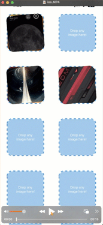
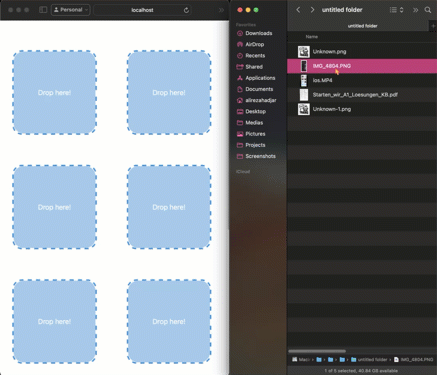

# Expo Drag Drop Content View

## What

A superset of `View` component that supports iOS, Android, and Web Native drag and drop feature.

<table>
  <tr>
    <th align="center">iOS</th>
    <th align="center">Android</th>
  </tr>
  <tr>
    <td align="center">
      
    </td>
    <td align="center">
      
    </td>
  </tr>
  <tr>
    <th align="center">Web</th>
    <th align="center">iPadOS</th>
  </tr>
  <tr>
    <td align="center">
      
    </td>
    <td align="center">
      
    </td>
  </tr>
</table>

## Features

- ✨ Support all file types (images, videos, texts, PDFs, audio, etc.)
- 📤 Drag any file to other apps
- 📬 Drag any file within the app
- 📥 Drop any file from other apps
- 🔨Support new architecture

## Documentation

- [Installation](https://expo-drag-drop-content-view.vercel.app/docs/guides/installation)
- [Usage](https://expo-drag-drop-content-view.vercel.app/docs/guides/usage)
- [API](https://expo-drag-drop-content-view.vercel.app/docs/api/overview)
- [Example](https://github.com/AlirezaHadjar/expo-drag-drop-content-view/tree/main/apps/example)

## Todo

- [x] iOS support
- [x] Android support
- [x] Allowing `children` to be touchable
- [x] Web support
- [x] Adding Drag support
- [x] Documentation
- [x] Adding dragging/dropping video support
- [x] Adding dragging/dropping text support
- [x] Adding dragging/dropping all file types support
- [x] Adopting new architecture
- [ ] MacOS support

## Acknowledgment

❤️ Special thanks to [Ali Nabavi](https://github.com/sali2001n) for helping to add Android support.

## License

[MIT](https://github.com/AlirezaHadjar/expo-drag-drop-content-view?tab=MIT-1-ov-file)
