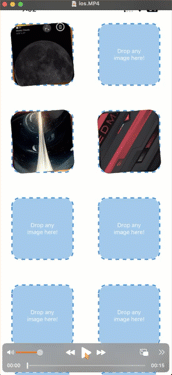

# Expo Drag Drop Content View

## What

A superset of `View` component that supports iOS, Android, and Web Native drag and drop feature.

|                       iOS                       |                        iPadOS                         |                         Android                         |
| :---------------------------------------------: | :---------------------------------------------------: | :-----------------------------------------------------: |
|  |  |  |

|                       Web                       |
| :---------------------------------------------: |
|  |

## Features

- 📤 Drag images to other apps
- 📬 Drag images within the app
- 📥 Drop images from other apps

## Documentation
- [Installation](https://expo-drag-drop-content-view.vercel.app/docs/guides/installation)
- [Usage](https://expo-drag-drop-content-view.vercel.app/docs/guides/usage)
- [API](https://expo-drag-drop-content-view.vercel.app/docs/api/overview)
- [Example](https://github.com/AlirezaHadjar/expo-drag-drop-content-view/tree/main/apps/example)

## Todo

- [x] iOS support
- [x] Android support
- [x] Allowing `children` to be touchable
- [x] Web support
- [x] Adding Drag support
- [x] Documentation
- [ ] MacOS support
- [ ] Adding dragging/dropping video support
- [ ] Adding dragging/dropping text support

## Acknowledgment

❤️ Special thanks to [Ali Nabavi](https://github.com/sali1290) for helping to add Android support.

## License

[MIT](https://github.com/AlirezaHadjar/expo-drag-drop-content-view?tab=MIT-1-ov-file)
